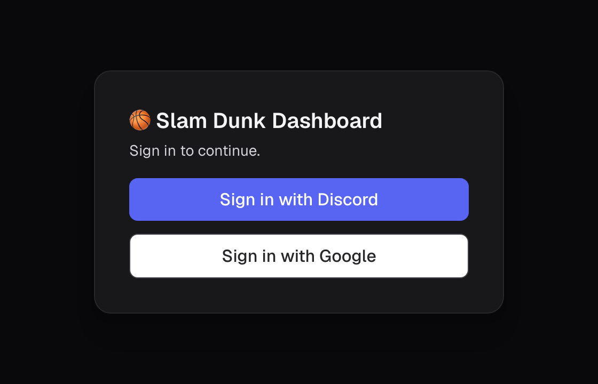
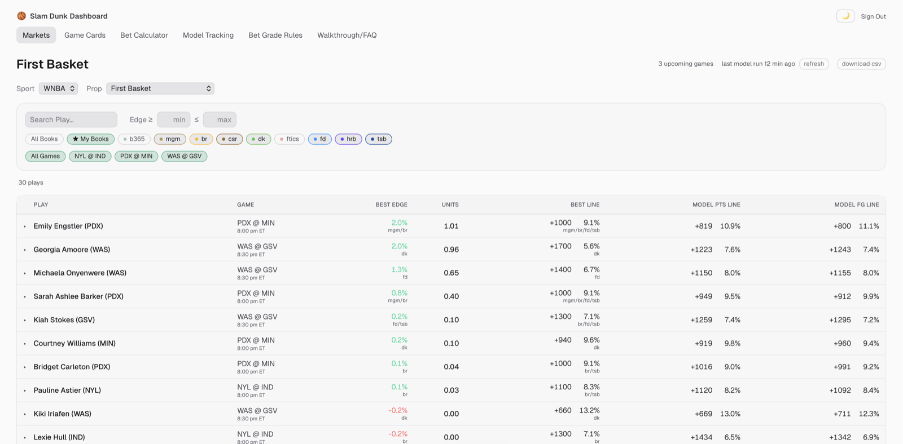
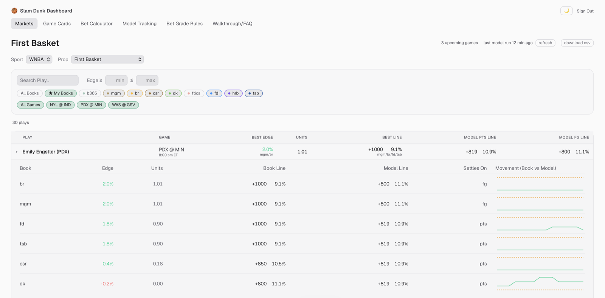
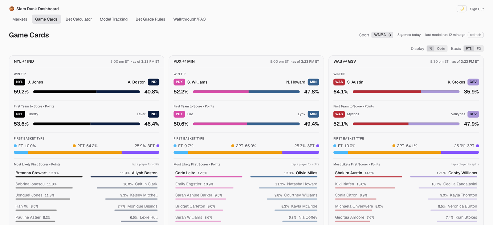
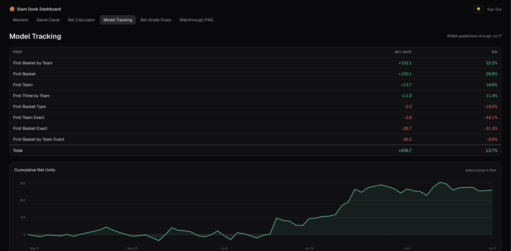
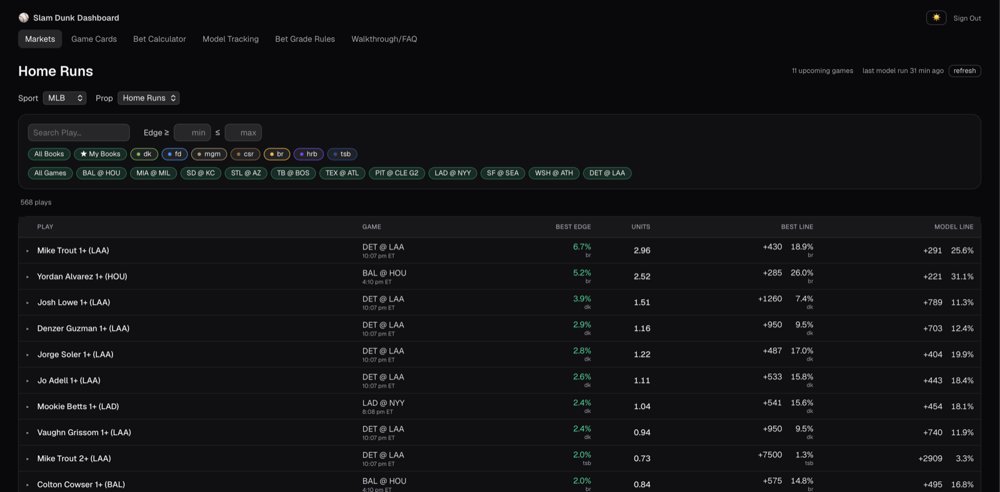

## Slam Dunk Dashboard

Every projection we run, in your browser. The **Slam Dunk Dashboard** takes the same NBA, WNBA & MLB model that powers our Discord picks and puts it in a live, sortable board — with per-book line movement, a built-in bet calculator, and our full graded track record. Save your go-to sportsbooks, flip odds between percent and American, and switch light or dark, on desktop or phone.

::: {.app-layout .column-page}

::: {.app-login}
### Getting in

Head to [app.slamdunk.bet](https://app.slamdunk.bet) and you'll be asked to sign in with **Discord** or **Google** right away. Active subscribers land straight on the board. Not subscribed yet? We'll send you to sign up first — subscribe once and you're in.

::: {.subscribe-ctas}
[Open the Dashboard](https://app.slamdunk.bet){.btn .btn-primary .btn-lg role="button"}
:::

::: {.app-login-shot}
{fig-alt="Slam Dunk Dashboard login screen with Sign in with Discord and Sign in with Google buttons"}
:::

New here? [Start with a subscription](subscribe.qmd) — your first month is free. Questions? Hit the [contact page](contact.qmd).
:::

::: {.app-carousel-col}

```{=html}
<div id="appCarousel" class="carousel slide" data-bs-ride="carousel" data-bs-interval="6000">
  <div class="carousel-indicators">
    <button type="button" data-bs-target="#appCarousel" data-bs-slide-to="0" class="active" aria-current="true" aria-label="Markets board"></button>
    <button type="button" data-bs-target="#appCarousel" data-bs-slide-to="1" aria-label="Per-book detail"></button>
    <button type="button" data-bs-target="#appCarousel" data-bs-slide-to="2" aria-label="Game cards"></button>
    <button type="button" data-bs-target="#appCarousel" data-bs-slide-to="3" aria-label="Model tracking"></button>
    <button type="button" data-bs-target="#appCarousel" data-bs-slide-to="4" aria-label="MLB markets"></button>
  </div>
  <div class="carousel-inner">
    <div class="carousel-item active">
      
      <p class="app-carousel-desc"><strong>The markets board</strong> — every prop, ranked by edge. Best available book line and implied %, our model's fair line, the edge, and recommended units. Sort any column, then expand a game for more.</p>
    </div>
    <div class="carousel-item">
      
      <p class="app-carousel-desc"><strong>Per-book detail</strong> — expand any play to see every book's price next to our model line, plus a live line-movement chart for each.</p>
    </div>
    <div class="carousel-item">
      
      <p class="app-carousel-desc"><strong>Game cards</strong> — one card per game. Win tip, first team to score, first-basket type and likely first scorer for NBA &amp; WNBA; NRFI/YRFI, weather, projected lineups and per-batter home-run odds for MLB.</p>
    </div>
    <div class="carousel-item">
      
      <p class="app-carousel-desc"><strong>The receipts</strong> — season-to-date model tracking with net units and ROI by prop, plotted as a running total. The whole graded record, right there to scroll.</p>
    </div>
    <div class="carousel-item">
      
      <p class="app-carousel-desc"><strong>All three leagues</strong> — MLB home-run and first-inning (NRFI/YRFI) markets sit right alongside the NBA and WNBA boards.</p>
    </div>
  </div>
  <button class="carousel-control-prev" type="button" data-bs-target="#appCarousel" data-bs-slide="prev" aria-label="Previous screenshot">
    <span class="carousel-control-prev-icon" aria-hidden="true"></span>
  </button>
  <button class="carousel-control-next" type="button" data-bs-target="#appCarousel" data-bs-slide="next" aria-label="Next screenshot">
    <span class="carousel-control-next-icon" aria-hidden="true"></span>
  </button>
</div>
```

:::

:::
