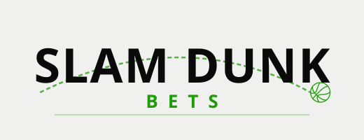
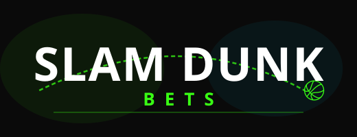
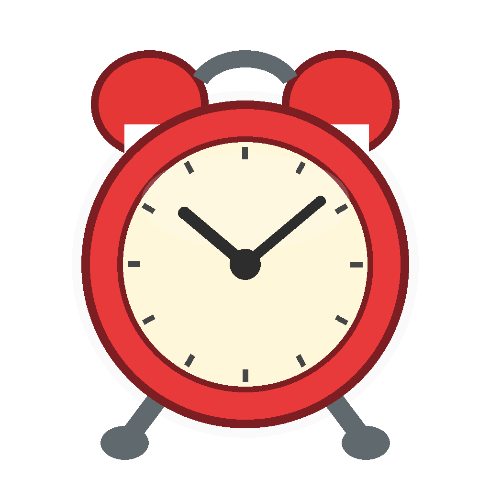

:::: hero
::: hero-banner
{.banner-light fig-alt="Slam Dunk Bets"} {.banner-dark fig-alt="Slam Dunk Bets"}
:::

# NBA, WNBA & MLB picks, backed by 8,000+ units of ROI since 2021–22.

::: hero-lede
Slam Dunk Bets is a subscription picks service run by data scientists and engineers. Our machine learning models project first-basket props for every NBA and WNBA game and home runs and NRFI/YRFI for every MLB game, compare them to sportsbook prices every 30 minutes, and post the edges to Discord with unit sizes. Every bet is tracked and graded in public.
:::

------------------------------------------------------------------------

[Subscribe — Free First Month](https://sharpduel.com/slam_dunk_bets){.btn .btn-primary .btn-lg role="button"}
::::

::: feature-list
## What you get 🧐

- **Best-in-class projections** for every NBA, WNBA & MLB game — first baskets, home runs, and more
- **NBA, WNBA & MLB prop data and picks** across a growing list of markets
- **Automatic updates every 30 minutes** — projections refresh all day
- **Discord access** with daily ROI receipts, tracked since the 2021–22 NBA season
- **Dashboards & data** to dive deeper for more edges and plays
:::

::::::: how-it-works
## How it works 🛠️

:::::: steps
::: step
{.model-image fig-alt="Robot"}

### 1. Model the slate

------------------------------------------------------------------------

Projections for every NBA, WNBA, and MLB game, built from the same stat foundation we've used since 2022.
:::

::: step
{.clock-image fig-alt="Alarm clock"}

### 2. Refresh every 30 minutes

------------------------------------------------------------------------

Picks update automatically as lines move — no stale numbers, no guesswork.
:::

::: step
{.discord-image fig-alt="Check mark"}

### 3. Post picks in Discord

------------------------------------------------------------------------

Daily picks and ROI receipts, straight to your phone through the Discord community.
:::
::::::
:::::::

::: track-record
## 8,000+ units of ROI since 2021–22 💰

We've tracked every pick since the 2021–22 NBA season, and the full cumulative chart is still climbing.

 for every season.](images/home/cumulative_total.png){fig-alt="Line chart of cumulative net units for Slam Dunk Bets picks from October 2021 to October 2026, climbing from 0 to about 8,600 units"}
:::

::: hall-of-fame
## Hall of Fame 🏆

Real green tickets from our users, updated daily on Discord.

```{=html}
<div class="hof-carousel-wrap">
  <div id="hofCarousel" class="carousel slide carousel-fade" data-bs-ride="carousel" data-bs-interval="3200" data-hof-manifest="images/hof-carousel/manifest.json" data-hof-image-base="images/hof-carousel/">
    <div class="carousel-inner">
      <div class="hof-loading" role="status" aria-label="Loading Hall of Fame receipts"></div>
    </div>
    <button class="carousel-control-prev" type="button" data-bs-target="#hofCarousel" data-bs-slide="prev" aria-label="Previous receipt">
      <span class="carousel-control-prev-icon" aria-hidden="true"></span>
    </button>
    <button class="carousel-control-next" type="button" data-bs-target="#hofCarousel" data-bs-slide="next" aria-label="Next receipt">
      <span class="carousel-control-next-icon" aria-hidden="true"></span>
    </button>
  </div>
</div>
<script src="scripts/hof-carousel.js"></script>
```
:::

::: final-cta
## Ready to cash in?

[Subscribe — Free First Month](https://sharpduel.com/slam_dunk_bets){.btn .btn-primary .btn-lg role="button"}

[Still have questions? See the FAQ](faq.qmd)
:::
