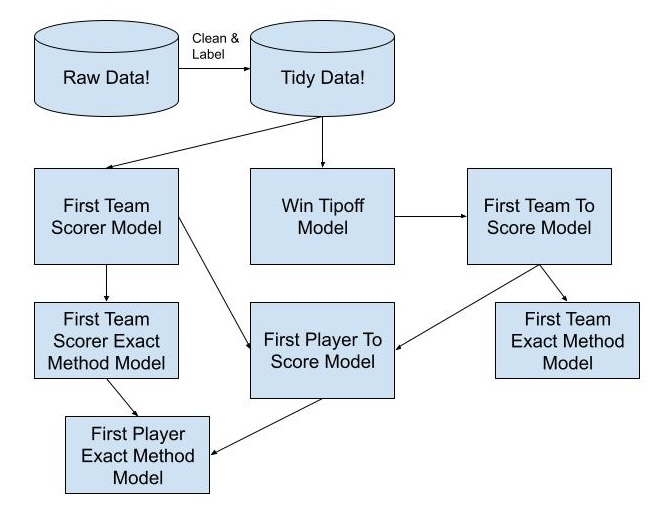

Our first post outlined why we bet on first baskets, but doesn't say anything at all about how we do it. These next posts will give some more context on our approach for predicting first basket outcomes. This first post will be a super high-level run through the process. Heck, I can even make a little diagram!

{fig-alt="Flowchart of the first-basket model pipeline: raw data is cleaned into tidy data, which feeds win tipoff, first team to score, first team scorer and first player to score models, ending in exact method models" width=600}

I'll walk through the boxes and arrows.

First, we get a bunch of data from different sources, most importantly play-by-play records from the NBA and WNBA.

We use those data to flag the winning player for every jump ball, and who they beat, as well as which players and teams score first and how it happened.

Once the data are labeled, we build models to predict the winner of a jump ball between players A and B. These models enable us to predict which team is going to possess the ball first, and knowing which team will possess the ball first is hugely predictive of which team will score first.

We could stop here, because "player to win the tipoff" and "team to score first" are popular prop markets in their own rights, but we keep going! Independent of first possession, we can also model which player will score first for their team given a specific lineup; this is also a very popular (and profitable) prop market. Even more, we model out the odds of a player scoring first for their team with a specific method, like a free throw or a three pointer.

Finally, we can use the outputs of the team to score first and player to score first for their team models, to estimate the odds of a player scoring first for the entire game (and the method they use). Tada!

Now that you've got the high level view, we can start looking more specifically at different parts of the process. We can start with the data!
