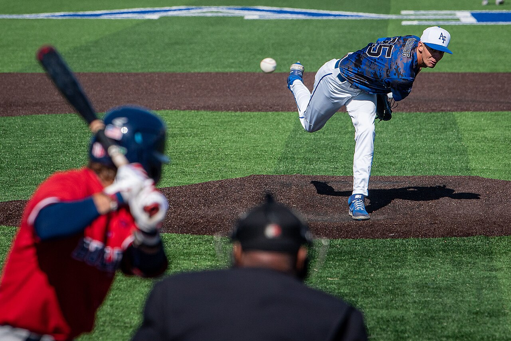

{width=600}

Home runs are the most exciting part of baseball, imho, and they don't happen very often — right around 3% of plate appearances. They're a pretty rare event, so figuring out whether a player is going to hit one is a little bit like finding that one lego brick you need in your bin of unsorted bricks.

We know home runs are at least a teensy bit predictable. Some players are going to hit a lot more home runs than others, year in and year out, and some players are hardly going to hit any. Same story on the mound: some pitchers give up way more homers than others. We know homers are more common at higher elevations (thanks Colorado!), on warmer days, in parks with shorter fences, and when the wind blows out from home plate.

But...how do you actually turn any of that into a prediction?

(That question is this whole series — the data, the models, the edges, the alerts, and the app. It will get long and nerdy. That's the fun part.)

It starts with data! Statcast publishes 119 columns about every single MLB pitch — velocity, spin, release point, exit velocity, launch angle, all the way down to the tilt of the batter's swing path. We mirror all of it, roughly 750,000 pitches per season going back to 2017, and then build our own layers on top: batter profiles (career numbers AND the trailing 40 games, with platoon splits and performance against different pitch types), pitcher profiles (arsenal, velocity, workload, recent form), park factors, fence distances in every direction (including the batter's pull side), elevation, roofs, temperature, wind. Plus team tendencies, like how quickly each club goes to its bench. Plus game-state stuff — score, outs, count, runners — which we'll get into in Part 2.

Rookies get seeded with minor-league data, and the translation is not gentle: MiLB power gets marked DOWN on the way up (a AAA dinger is worth about 80% of an MLB one in our priors), strikeout rates get marked up, and lower levels count for less than AAA. Sorry, rooks. And every rate in every profile gets empirical-Bayes shrinkage, which is a fancy way of saying small samples get dragged toward league average until they earn their distance. One hot week does not make you Aaron Judge. Yet.

All told, our models use around 145 features per pitch (145 to 154, depending on the model), which is way more information than I can juggle in my brain at any point in time, let alone for every pitch of every game on a full slate. Fortunately, that's where the ML models come in.

We use a chain of models — boosted decision trees, trained on about six million pitches — to predict what happens on each pitch, one question at a time:

1.  **What's he throwing?** Statcast tags pitches with 18 different type codes; we collapse them into six classes (fastball, sinker, cutter, breaking, offspeed, other) because for our purposes the coarse distinctions are the ones that matter. And they DO matter: in 2024, balls in play against four-seamers became homers about 5.3% of the time, versus 3.2% against sinkers.
2.  **Does he swing?** Given the pitch class, the count, and everything else about the matchup.
3.  **What happens on the swing?** Whiff, foul, or fair contact — with a sibling model handling the takes: ball, called strike, or the occasional plunking.
4.  **What happens on contact?** Single, double, triple, home run, or out, priced off the batter's power, the pitcher, the park, and the weather.

(Fun aside: none of these models ever sees pitch *location*, on purpose. Our simulator only decides WHAT gets thrown, not where, and if you hand location-hungry models a filled-in average location, every simulated pitch becomes a down-the-middle meatball. Ask us how we know.)

Sharp-eyed readers might notice there's no ball-physics step in that list. There used to be! We had models that predicted exit velocity and launch angle off the bat, then turned the physics into outcomes, and they were beautiful. Then we tested them head-to-head against the boring direct approach over a full season, and the boring approach was a hair more accurate and literally twice as fast. So the physics models got benched — they still hang around as diagnostics, but they don't touch the predictions anymore. The number of models drifts between five and seven as we experiment (RIP to the physics arm), and the current starting five is the list above.

Accuracy is what everybody wants to talk about with models, and ours do pretty well for predicting the outcomes of hundreds of interactions between groups of human beings. On the question that matters — does this batter homer in this game — our AUC runs in the .6 to .7 range across backtests and live seasons (this season: .61 through late July, across about 7,000 player-games), with Brier scores around .10 and calibration error around a single point of probability. Translated from nerd: the model is meaningfully better than naive guessing at separating homer games from no-homer games, and when it says 12%, homers happen about 12% of the time. In this business, that second part is the superpower.

Chains of models can be REALLY useful (it's the same trick behind our [first-basket models](../2024-10/predict-first-baskets-1.qmd)), but they undeniably add complexity, and they add the risk of compounding errors: mess something up in the first model and it flows downstream through everything else, because each model takes the previous outputs as inputs. Are they worth it?

Our research says yes. You can absolutely estimate a batter's probability of homering with the simplest possible method: count his games, count his homer games, divide. If Jim played 100 games and homered in 10 of them, call it 10% (+900 in American odds). Totally intuitive, easy to update, and genuinely a lot better than flipping a coin. But the chained approach beats that baseline by roughly +.02 to +.04 of AUC, season after season, in leak-free backtests. That sounds modest, so here's the honest version: home runs are HARD, nobody's model sees the future, and a couple points of AUC is the difference between finding real edges and donating vig to the books. The complexity earns its keep. (One of our favorite findings along the way: home runs are overwhelmingly a *batter* skill. A pitcher's homer-allowed history carries almost no predictive weight — that's not a bug in our models, it's a fact about baseball.)

So that's cool — we can price individual pitches. But the bets are on games, and games have STATE. That's [Part 2 of ...](predict-home-runs-2.qmd), where we get into score effects, lineups, and the simulations that hold this whole thing together. Thanks for reading!
