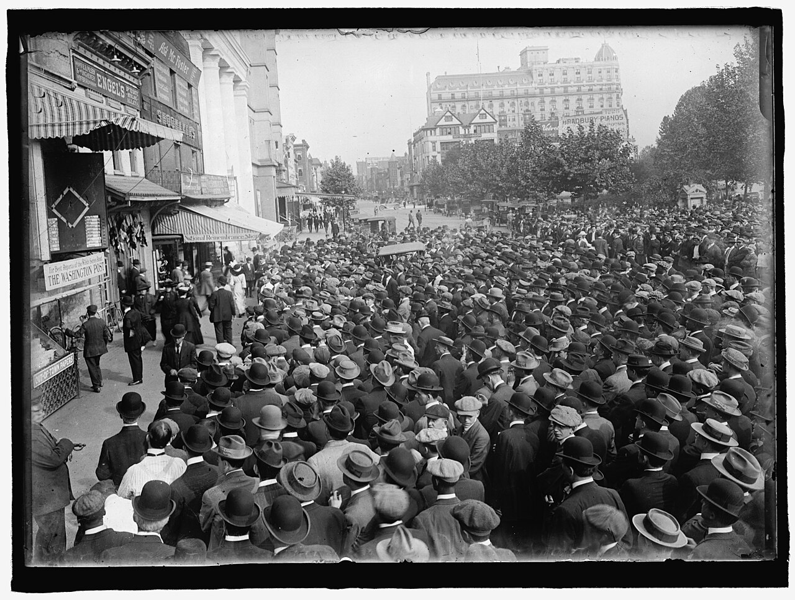

{width=600}

Everything in [Part 1](predict-home-runs-1.qmd) is stuff we know before first pitch, and you could stop there: throw the pregame features into a model and get a decent baseline probability that a player goes deep. But pitches don't happen in a vacuum, they happen inside games. Pitchers change their approach when they're protecting a big lead or chasing from behind, when they're ahead or behind in the count, when there are runners in scoring position. Batters do the same! With two strikes, the pitch mix tilts hard toward breaking and offspeed stuff — and as we covered in Part 1, breaking balls become dingers a lot less often than heaters do. Our models see all of it: balls, strikes, outs, all 24 combinations of runners and outs, the inning, the score difference, times through the order, home/away, and the handedness matchup.

And then there's the obvious one: a player's chances of homering in a game rise and fall with his plate appearances. So how a team moves through its lineup — and how it handles substitutions, for defense or pinch-hitting or pinch-running — matters a LOT. By the time the lineup turns over a third time, the 9-hole hitter is about three times as likely as the leadoff man to have been lifted, and some clubs go to their bench much faster than others. Our sim tracks per-slot survival odds and per-team pinch-hit tendencies for exactly this reason.

Given all that, it should be pretty clear: the state of the game is a real predictor of whether an at-bat produces a homer, and the state changes on every pitch. So how do you account for game states before the game even starts? SIMULATIONS.

But first, a confession: we don't actually roll dice pitch by pitch. For every batter-pitcher matchup, in every context, we solve the plate appearance EXACTLY. There are only 12 possible counts and six pitch classes, so a plate appearance is really a little 72-cell grid: push probability through every path — every pitch choice, every swing and take, every foul — until all of it has been absorbed into an outcome. Foul balls with two strikes just loop the count back on itself, and the math is perfectly happy to price the at-bat that takes a dozen foul balls to resolve. Out the other side comes an exact distribution for that matchup: strikeout, walk, hit-by-pitch, single, double, triple, homer, out. No randomness, no simulation noise, just probability doing its job.

THEN we roll dice. We simulate each game 20,000 times, plate appearance by plate appearance, through a full game-state machine: lineups turning over, starters running out of gas, bullpens, pinch hitters, baserunners doing baserunner things (the sim knows a runner on second scores on a single about 60% of the time). The endings are score-aware, too: a home team that's leading skips the bottom of the ninth, walk-offs end innings mid-stream, and ties go to extras with the free runner on second (yes, the Manfred runner lives in our simulator; no, he cannot be traded). Getting the endings right isn't just cosmetic — it fixed a systematic ~5% inflation in home hitters' projections, since home teams bat in the ninth a lot less often than a lazy sim assumes.

After 20,000 sims we can answer questions like, "in what percentage of sims for the Phillies-Dodgers game did Ohtani go yard?" That proportion is our probability — the number that eventually becomes a projection, an edge, and maybe an alert. Why 20,000? Because at a 10% homer probability, that's enough sims to shrink the random noise to about ±0.2 points — and in our testing, extra sims sharpen the PRICES, not the model. Backtest accuracy is flat whether we run 2,000 or 20,000. Precision is for the odds; accuracy was decided back in Part 1. (Also: everything is seeded, so every run is perfectly reproducible. The seed is 2026. Because of course it is.)

Now, simulating every game 20,000 times, then re-simulating all day as lineups post and weather shifts, sounds computationally expensive. Three tricks keep it manageable:

1.  **Solve once, sample cheap.** The expensive part is the exact plate-appearance math — about three seconds of thinking per game. After that, each additional simulated game costs six *hundredths* of a millisecond.
2.  **Simulate wide.** Instead of looping through 20,000 games one at a time, we advance all 20,000 together, one plate appearance per step, as big numpy arrays. The slow part of the code scales with the length of a game, not the number of sims.
3.  **Fingerprints.** Every game's projection carries a signature of its inputs: lineups, starters, weather (bucketed into 3°F and 2 mph steps, so ordinary forecast wobble doesn't count as news). New update, same signature? Skip the re-run. And once a game goes live, its pregame projection freezes for good.

Add it up and a full slate re-scores in about the time it takes to microwave a burrito, on an old i7 with 16GB of RAM. Still just a couple of guys on laptops over here. V nifty.

One last step before the numbers are ready for prime time: calibration. An assembled simulator carries small compounding biases — ours ran a touch hot on balls in play, and its generic bullpens were a touch friendlier to hitters than real ones — so a final calibration layer, fit on held-out data, trues everything up. It stretches the tiniest probabilities upward (a raw 2% becomes about 4%) and trims the biggest ones (a raw 20% becomes about 17%). The goal is simple: when we publish 12%, we mean 12%.

So now we've got a calibrated probability that any batter in baseball goes deep tonight. A probability is not a bet, though. In [Part 3 of ...](predict-home-runs-3.qmd) we turn projections into edges. Thanks for reading!
