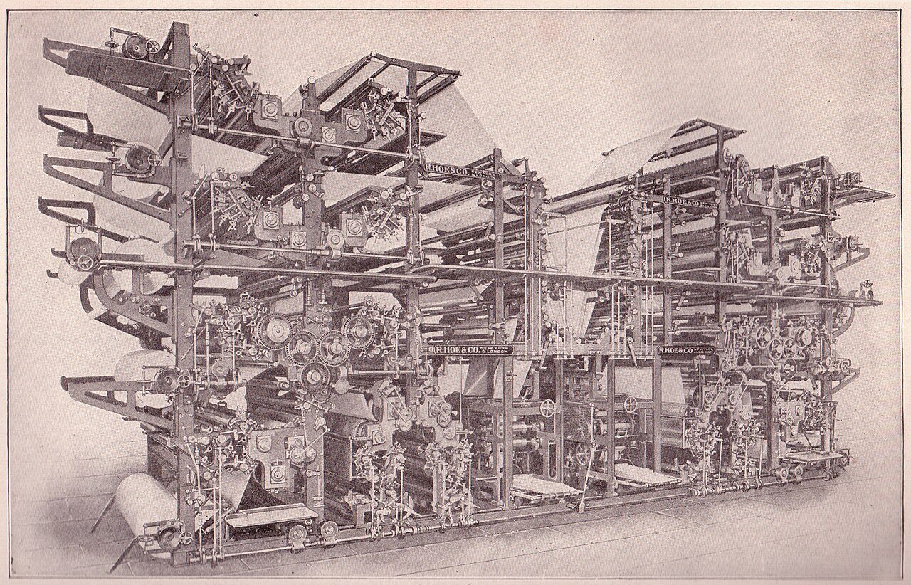

{width=600}

If you read our [first-baskets series](../2024-10/predict-first-baskets-1.qmd), you already know we're obsessive about the last mile. A projection that never reaches you, or reaches you stale, might as well not exist. So the whole system runs like a tiny newspaper with an extremely niche beat.

Every Monday at 2am, the models retrain on everything through the day before. Every morning at 6am, a full refresh: schedules, rosters, park factors, yesterday's plays graded and logged. And then every 30 minutes from 7am to 10pm ET, a tick: pull the newest pitch data, check for posted lineups and probable starters, grab a fresh hourly forecast for every ballpark, re-simulate every game whose inputs actually changed (the fingerprint trick from [Part 2](predict-home-runs-2.qmd)), re-price 13 books, and push alerts.

Weather gets the full nerd treatment, by the way. Wind "blowing out" isn't a vibe — every forecast is resolved against the actual compass bearing from home plate to center field in that specific park, so a gust that's blowing out in one stadium is a crosswind in another. Domes are a permanent 72°F and windless, which is boring, but boring is easy to model. Retractable roofs get a per-game open-or-closed call.

Alerts land in Discord looking like this:

> **LAA @ TEX (8:05 pm ET)**
>
> -   Josh Lowe 1+ (proj +519): +750 br (2.5u), +720 dk (2.3u), ...
> -   Jorge Soler 2+ (proj +545): +600 br (0.7u)

Games in start-time order, plays sorted by edge, every qualifying book listed with its price and recommended units, best value first. And the emoji do actual work:

-   🚨 first time a play qualifies today
-   🚀 new day-high in value — the market moved further from us
-   ⬇️ still playable, but off its peak
-   📖 a new book just joined the party

The high-water marks reset at midnight ET, so a 🚀 is always a genuinely new best — a play that faded and crawled back to a price it already hit today gets a ⬇️, never a fresh rocket.

And when a game goes live, we stop. Projections freeze at first pitch — no in-game re-pricing, no chasing. Pregame edges are our lane, and we stay in it.

If Discord isn't your speed, the same numbers live in the Slam Dunk Dashboard at [app.slamdunk.bet](https://app.slamdunk.bet): one card per game, with the weather, projected lineups, first-inning odds, and per-batter home run odds. And because we archive the full edge table on every single odds refresh, the app can show you how prices moved through the day — when the books adjusted, which direction, and whether the value is growing or already got eaten.

And that's the machine: 119 columns on every pitch, six million pitches of training data, a chain of models, an exact little 72-cell plate-appearance solve, 20,000 simulations per game, a calibration layer, 13 books twice an hour, half-Kelly sizing, and a rocket emoji when it matters. From data to dingers, we've covered the bases. For real this time — it's baseball. The bases are literal.

Thanks as always for reading, holler if you have questions ([\@jimtheflash](https://x.com/jimtheflash) is the best way to find us), and if you want these alerts in your pocket, please consider [subscribing](https://sharpduel.com/slam_dunk_bets) — first month's free — or come hang out in the [Discord](https://whop.com/slam-dunk-bets) 🙏
